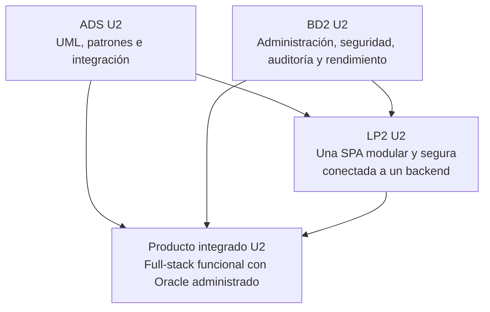

# Unidad 2 - Producto integrado

## Corte U2

El corte de Unidad 2 demuestra que el diseño técnico, la base Oracle administrada y la aplicación full-stack modular ya funcionan como un sistema integrado sobre `Producto`, `Categoria`, `Venta`, `DetalleVenta` y `Usuario`. ADS consolida UML, patrones e integración; BD2 administra, asegura y optimiza Oracle; LP2 integra una sola SPA modular y segura con la aplicación Spring Boot.

**BomERP es el ejemplo del docente, no el dominio obligatorio.** Cada sede (Lima, Juliaca, Tarapoto) y cada grupo dentro de una misma sede sustenta su propio dominio, declarado desde el [brief.md](../brief.md) de S2. Las secciones siguientes usan los nombres de BomERP solo como referencia concreta; cada equipo los lee en clave de sus propios módulos.

## Producto integrado U2

**Aplicación full-stack funcional con diseño de integración y base Oracle administrada, optimizada y asegurada.**

## Productos por curso

| Curso | Producto U2 | Archivo |
|---|---|---|
| ADS | Catálogo UML con patrones de diseño e integración aplicados. | [Producto ADS U2](ads-producto.md) |
| BD2 | Base de datos empresarial administrada, optimizada y asegurada. | [Producto BD2 U2](bd2-producto.md) |
| LP2 | Una SPA empresarial modular y segura, conectada al único backend Spring Boot, con navegación por funcionalidades, CRUD, formulario transaccional, consultas, reportes y control de acceso. | [Producto LP2 U2](lp2-demo.md) |

## Integración esperada

## Evidencia mínima

- Catálogo UML con clases, secuencia, actividad y trazabilidad.
- Patrones Controller, Service, Repository, DTO, Mapper o equivalentes.
- Diseño de integración empresarial.
- Usuarios, roles, privilegios y principio de mínimo privilegio en Oracle.
- Evidencia de almacenamiento, auditoría, optimización y particionamiento.
- Una SPA con `core`, `shared`, módulos funcionales, layout, menú, navegación, servicios HTTP y CRUD de `Producto`.
- CRUD de `Categoria–Producto` con listas relacionadas y validación de dependencias.
- Formulario `Venta–DetalleVenta`, cálculos, confirmación, consultas y reportes.
- Seguridad backend propia con hash de contraseñas, JWT, roles, permisos y endpoints protegidos; SSO queda fuera del producto obligatorio.
- Seguridad frontend con sesión, expiración, guards, interceptores, menú por permisos y manejo de 401/403.
- Pruebas del flujo completo desde autenticación hasta persistencia, consulta y control de acceso.

## Transición hacia Unidad 3

| Curso | En U2 queda | En U3 se convierte en |
|---|---|---|
| ADS | Catálogo UML, patrones e integración. | Diseño técnico final con ADRs, trazabilidad y sustentación. |
| BD2 | Base administrada, optimizada y asegurada. | Base resiliente con backup, recovery, monitoreo y diagnóstico. |
| LP2 | Una SPA modular segura, conectada al backend y con control de acceso. | Base Full-Stack de BomERP optimizada, monitoreada, paginada, auditada, estabilizada y sustentada. |
