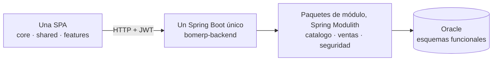

# LP2 - Producto de Unidad 2

## Producto

**Una SPA empresarial modular y segura, conectada al único backend Spring Boot de BomERP, con navegación por funcionalidades, CRUD, formulario transaccional, consultas, reportes y control de acceso.**

La demo usa navegador y almacenamiento local para representar un subconjunto de `Venta–DetalleVenta`: login, sesión, guard, registro, anulación y consulta. Es una referencia visual publicable en MkDocs, no reemplaza el producto evaluado. La implementación real debe ser una sola SPA y consumir el backend REST modular.

## Organización funcional esperada

```text
src/app/
├── core/                 # sesión, guards, interceptores y layout
├── shared/               # componentes reutilizables
└── features/
    ├── catalogo/         # funcional
    ├── ventas/           # funcional
    ├── inventario/       # ruta preparada o funcional según alcance
    ├── compras/          # ruta preparada; no es requisito funcional
    └── seguridad/        # login y control de acceso
```

No se crean una SPA para ventas y otra para compras. Los módulos funcionales comparten el shell, pero mantienen rutas, componentes, servicios HTTP y modelos propios.

## Demo ejecutable

[Abrir demo SPA U2](demo-spa/index.html)

## Evidencias exigidas al producto real

| Elemento | Qué demuestra |
|---|---|
| Login | Obtención de JWT desde el backend propio del curso. SSO no forma parte del producto obligatorio. |
| Guard | Bloqueo de vista protegida sin autenticación. |
| Interceptor | Adjunta token simulado a llamadas internas. |
| Navegación modular | Shell único, menú, rutas y acceso a funcionalidades de la base de BomERP. |
| CRUD independiente | Gestión completa de `Producto`. |
| CRUD dependiente | Gestión de `Categoria–Producto`. |
| Formulario cabecera–detalle | `Venta–DetalleVenta` dinámico, cálculos, validaciones y confirmación. |
| Consultas y reportes | Filtros y presentación de respuestas resumidas. |
| Control de acceso | Menú, rutas y acciones condicionadas por rol o permiso. |

## Casos de prueba

| Caso | Acción | Resultado esperado |
|---|---|---|
| Acceso sin token | Entrar al dashboard sin login. | Vista bloqueada. |
| Login válido | Ingresar admin/admin123. | Dashboard habilitado. |
| CRUD maestro | Crear, editar y eliminar un dato independiente. | La SPA y el backend mantienen datos consistentes. |
| CRUD dependiente | Registrar un dato relacionado. | Las listas y dependencias se validan. |
| Crear venta | Enviar cliente y detalles válidos. | Venta aparece asociada al usuario autenticado. |
| Validación | Cantidad inválida o stock insuficiente. | Mensaje de error sin persistencia parcial. |
| Anular venta | Ejecutar anular. | Estado cambia, se repone stock y se actualiza el resumen. |
| Permiso insuficiente | Ejecutar una acción restringida. | La acción se oculta o responde 403. |

## Integración esperada


