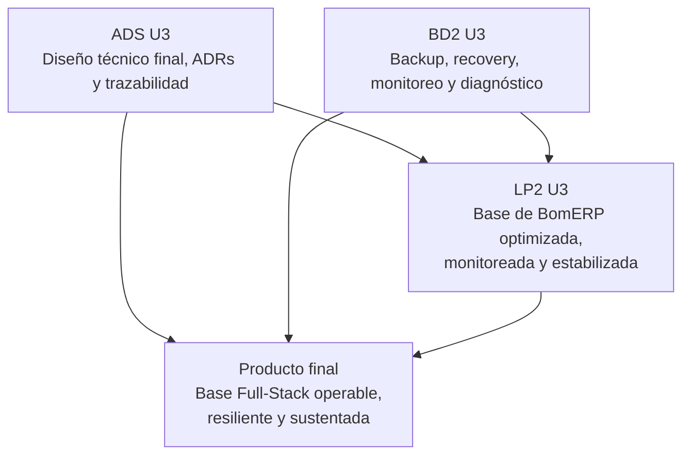

# Unidad 3 - Producto integrado

## Corte U3

La Unidad 3 consolida el producto final del ciclo. No repite la funcionalidad de U2: demuestra que la aplicación full-stack ya puede ser operada, recuperada, monitoreada, explicada y defendida técnicamente.

## Producto integrado U3

**Base Full-Stack modular de BomERP integrada, optimizada, monitoreada y estabilizada, con diseño técnico final, base Oracle resiliente, evidencias y sustentación técnica.**

Este producto evidencia que el equipo no solo construyó una aplicación funcional, sino que también cerró su diseño técnico, estabilizó el producto, preparó operación básica, documentó evidencias y puede sustentar decisiones de punta a punta.

**BomERP es el ejemplo del docente, no el dominio obligatorio.** Cada sede (Lima, Juliaca, Tarapoto) y cada grupo dentro de una misma sede cierra su propio producto final sobre su propio dominio, declarado desde el [brief.md](../brief.md) de S2. Las secciones siguientes usan los nombres de BomERP solo como referencia concreta; cada equipo los lee en clave de sus propios módulos.

## Productos por curso

| Curso | Producto U3 | Archivo |
|---|---|---|
| ADS | Diseño Técnico Profesional Documentado. | [Producto ADS U3](ads-producto.md) |
| BD2 | Base Oracle operativa, administrada, optimizada, auditada y resiliente. | [Producto BD2 U3](bd2-producto.md) |
| LP2 | Base Full-Stack modular de BomERP: una SPA, una aplicación Spring Boot única (módulos verificados con Spring Modulith) y una base Oracle por esquemas funcionales, optimizadas, monitoreadas y estabilizadas. | [Producto LP2 U3](lp2-producto.md) |
| Integrado | Evidencia final de trazabilidad, operación, pruebas y sustentación. | [Checklist final](checklist-final.md) |

## Integración esperada

## Evidencia mínima para presentar

- Diseño técnico final con arquitectura, UML, patrones, ADRs y trazabilidad.
- Matriz final ADS-BD2-LP2.
- Evidencia de backup, recovery, monitoreo y diagnóstico Oracle.
- Evidencia LP2 de Lazy Loading o Code Splitting y build optimizado.
- Política de caché del navegador y uso justificado de Redis o justificación técnica de no uso.
- Logs estructurados, endpoint de salud y monitoreo básico.
- Paginación de al menos un listado de alto volumen conservando filtros y ordenamiento.
- Auditoría técnica con usuario, fecha, acción, entidad y cambio relevante.
- Pruebas end-to-end y regresión del flujo principal.
- Bitácora de estabilización y corrección de errores.
- Plan de pruebas funcionales, seguridad, integración y operación.
- Guía de despliegue o ejecución.
- Repositorio con topics, documentación MkDocs o equivalente y evidencias reproducibles.
- Evidencia de un único ejecutable Spring Boot, módulos cohesionados, repositorios privados y dependencias unidireccionales.
- Sustentación técnica con aporte individual.

## Diferencia entre U2 y U3

| Aspecto | Unidad 2 | Unidad 3 |
|---|---|---|
| Enfoque | Integración funcional. | Operación, resiliencia, estabilización y defensa final. |
| ADS | Catálogo UML y patrones. | Diseño técnico final, ADRs y trazabilidad completa. |
| BD2 | Base administrada, optimizada y asegurada. | Base respaldada, recuperable, monitoreada y diagnosticable. |
| LP2 | Una SPA modular segura integrada a una aplicación Spring Boot modular. | Base modular de BomERP optimizada, paginada, auditada, probada, estabilizada y sustentada. |
| Evidencia | Funciona integrado y con control de acceso. | Funciona, se optimiza, se monitorea, se audita, se recupera, se explica y se defiende. |

## Criterios de aprobación U3

| Criterio | Evidencia |
|---|---|
| Trazabilidad final | Requerimiento/diseño, objeto Oracle, endpoint, pantalla y prueba relacionados. |
| Operación Oracle | Backup, recovery, monitoreo, diagnóstico y evidencias. |
| Preparación para producción | Build optimizado, caché, logging, salud, monitoreo y guía de despliegue. |
| Integración y estabilización | Paginación justificada, auditoría, E2E, errores corregidos y resultados documentados. |
| Sustentación | Cada integrante defiende una parte verificable. |
| Reproducibilidad | Repositorio y documentación permiten ejecutar o revisar el producto. |

## Documentación y reporte del producto final

### Plantilla mínima de documentación MkDocs o equivalente

La documentación publicada no reemplaza al informe. Su función es permitir que otra persona comprenda, ejecute, revise y verifique el producto desde el repositorio.

| Página o sección | Contenido mínimo | Evidencia esperada |
|---|---|---|
| Inicio | Nombre del proyecto, problema, solución, curso o cursos, integrantes y enlace al repositorio. | Presentación clara del producto. |
| Instalación o ejecución | Requisitos, dependencias, configuración y comandos para ejecutar el proyecto. | Instrucciones reproducibles. |
| Uso del sistema | Flujo principal, pantallas, comandos, endpoints, notebooks o casos de uso según corresponda. | Guía breve para probar el producto. |
| Arquitectura o estructura | Diagrama, componentes, carpetas principales y decisiones técnicas. | Vista técnica comprensible. |
| Módulos o funcionalidades | Descripción de las funciones principales del producto. | Relación entre funcionalidades y problema. |
| Datos | Modelo, archivos, base de datos, datasets, fuentes o estructura de almacenamiento según el curso. | Evidencia de gestión de datos. |
| Pruebas y evidencias | Casos de prueba, capturas, resultados, métricas, validaciones o salidas generadas. | Verificación del funcionamiento. |
| Equipo y aporte individual | Integrantes, responsabilidades, aportes y evidencias de participación. | Autoría verificable. |
| Repositorio y estándares | Topics académicos, estructura, commits, ramas si aplica y criterios de reproducibilidad. | Cumplimiento de estándares técnicos. |
| Limitaciones y mejoras | Restricciones del producto y mejoras futuras priorizadas. | Cierre reflexivo y realista. |

La documentación debe estar disponible desde las primeras presentaciones y crecer con el proyecto.

### Plantilla sugerida de informe del proyecto

El informe debe documentar el producto integrador como un solo sistema empresarial, no como tres entregables separados. Debe evidenciar la trazabilidad entre ADS, BD2 y LP2.

| Sección | Contenido mínimo | Evidencia esperada |
|---|---|---|
| Portada | Nombre del proyecto, cursos, sección, integrantes, docentes y semestre. | Datos completos del equipo. |
| Resumen ejecutivo | Problema, solución full-stack y valor para el negocio. | Síntesis de 10 a 15 líneas. |
| Competencia y trazabilidad | Competencia/capacidad del PI y competencias relacionadas. | CE021, CE022, CE023 y CE024 vinculadas al producto. |
| Alcance y diseño técnico | Contexto, restricciones, atributos de calidad y decisiones. | Documento de diseño, ADRs o diagramas. |
| Arquitectura | C4, UML, patrones, componentes e integración. | Diagramas y explicación técnica. |
| Base Oracle | Administración, seguridad, auditoría, rendimiento, backup y recovery. | Scripts, capturas, planes, evidencias y monitoreo. |
| Backend REST | Conexión, APIs, DTO, CRUD, transacciones, consultas, reglas y seguridad. | Código, endpoints, pruebas y documentación. |
| Frontend SPA | Navegación, CRUD, formularios cabecera–detalle, consultas, guards, interceptores y UX. | Capturas, componentes y demo funcional. |
| Integración y operación | Relación diseño-BD-API-SPA, optimización, monitoreo, auditoría y validación. | Demo end-to-end, paginación, pruebas, logs, métricas y evidencias. |
| Repositorio y documentación | Repositorio, topics, estructura, instrucciones y documentación publicada. | URL del repositorio y MkDocs o equivalente. |
| Aporte individual | Responsabilidad de cada integrante por curso o componente. | Tabla de tareas, commits o evidencias por integrante. |
| Limitaciones y mejoras | Límites del sistema y mejoras posibles. | Lista priorizada y realista. |
